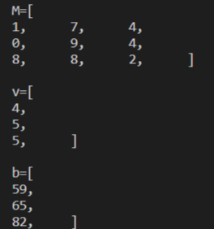
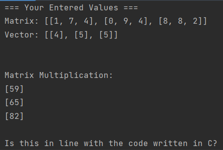
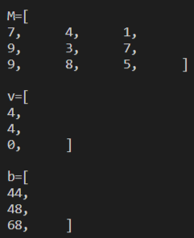
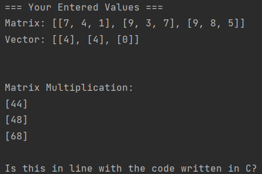
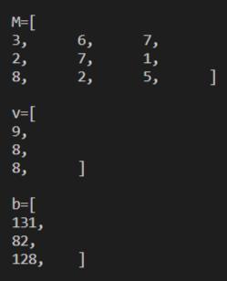
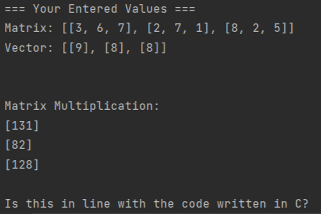
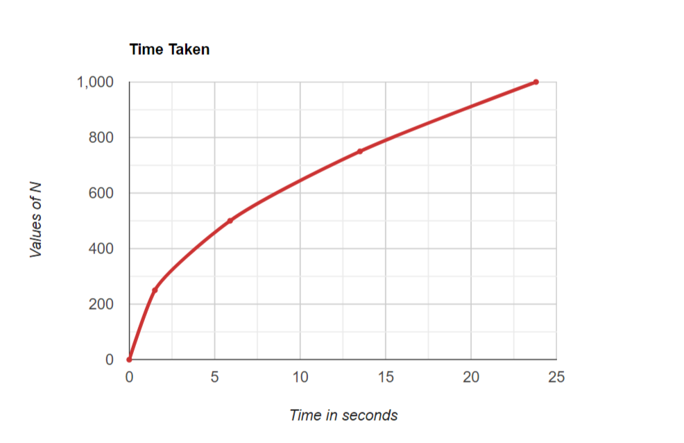
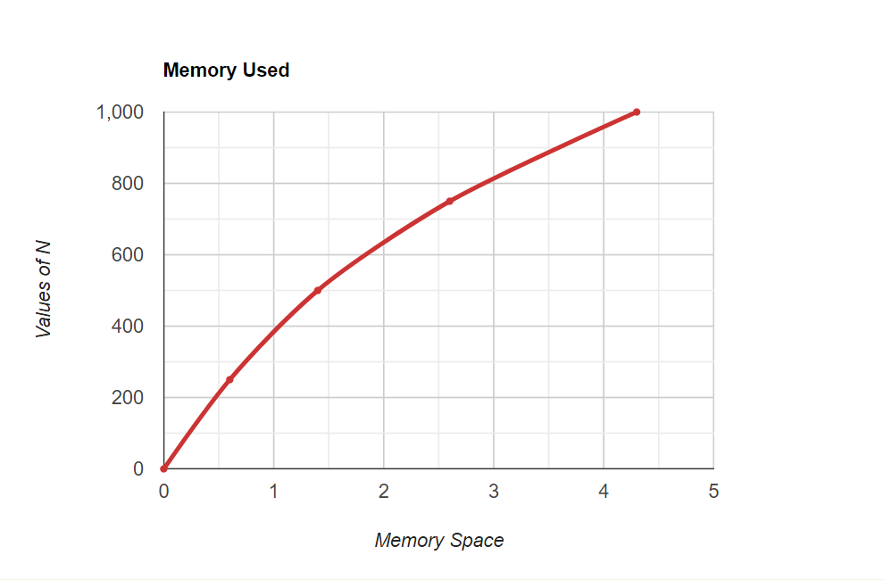

# The Matrix-Vector-Multiplication Repository

This function is to randomly generate a number matrix and a number vector, and then multiply them together. The code creates an NxN matrix, and an Nx1 vector, takes those values, and then multiplies them.

## For Windows:

We'll need a library object to start. Just type this
code into your terminal:

```compile
gcc -c mylib/mylib.c
```

The code will create a library object under the name mylib.o.

This is the content of the "Makefile" file.

```makefile
all: your_file.exe
your_file.exe: mylib.o
	gcc -o your_file your_file.c mylib.o
mylib.o: mylib/mylib.c
	gcc -o your_file.exe your_file.c mylib.o
clear:
	rm *.exe
	rm *.o
```

To make the .exe file, simply input the command "make all", or if you use the MinGW32 software,
using the command "MinGW32-make". Make sure to replace "your_file" with the
name of the .c file you wish to run. Additionally, to run the .exe file, simply type in the command:
".\your_file.exe", replacing "your_file" with the name of the .c file, of course.

For the .c file names, please refer to the list given below.

## For Linux:
To run the main file, simply compile the code by using:

```linux
gcc -c mylib/mylib.c -o mylib.o
gcc -c main_test.c -o main.o
```

To run the benchmark files, replace "main_test.c" with the file names given in the list below.

After properly naming the file, run the file by inputting:

```linux2
gcc -o main.out main.o mylib.o
```
## Benchmark .C File Names:

- Time Iterative: main_b_time_iterative
- Time Recursive: main_b_time_recursive
- Space Iterative: main_b_space_iterative
- Space Recursive: main_b_space_recursive

# Disclaimer

Space is not calculated automatically. In order to actually view the values for yourself, run the .exe file, then go to your 
Task Manager, or any local system information UI, and check the memory space consumed by the program. Time, on the other hand,
is automatic, and will print the statement right onto the terminal for the user to view freely.

## Self Testing

Here is the code done for a randomly generated matrix multiplied with the vector on C Language, and along
side it the same values inputted into a perfectly working Python machine using the numpy library. (The top image is the C-Language program, and bottom is Python.

### Test 1:




### Test 2:




### Test 3:




## Further Testing and Data Visualiziation

Simply put, in order to plot a comprehensive graph, only one value was used within the matrix, that was [5]. So, this was the time taken and space used in an NxN matrix filled with the value [5].



As the values were not constant due to a machine with running process, an average was taken. This was the time taken to run the code and print out the input matrix, vector, and result.

```
250 = 1.548s, 1.534s, 1.526s; Average = 1.54s
500 = 5.942s, 6.00s, 5.906s; Average = 5.95s
750 = 13.417s, 13.23s, 13.747s; Average = 13.5s
1000 = 24.049s, 23.32s, 24.145s; Average = 23.8s
```
Under the same conditions, I ran the code and looped it over to find the space complexity. These were
the values found when N increased by 250 periodically.



```
250 = 0.6MB
500 = 1.4MB
750 = 2.6MB
1000 = 4.3MB
```

Have fun with the code!
